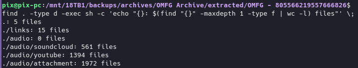

# discord-server-media-downloader

### Download every audio file from a discord server

works on:
- discord uploaded attachment
- soundcloud link/soundcloud channel
- youtube video/youtube channel

## Install and run

```
git clone https://github.com/PixelMelt/discord-server-media-downloader
cd ./discord-server-media-downloader
```
Stop and place logs obtained with [DiscordChatExporter](https://github.com/Tyrrrz/DiscordChatExporter) into a folder named logs placed in the root dir of this project.
```
node logsLinkPuller.js
```

### Results after run:


## Note
This was hacked together in an hour or so, you might need to tinker with it to get it to work.